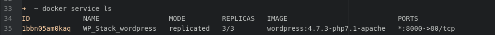
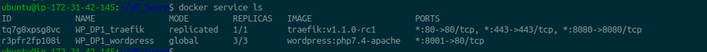
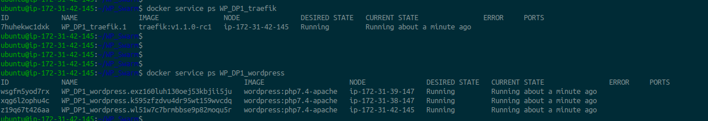
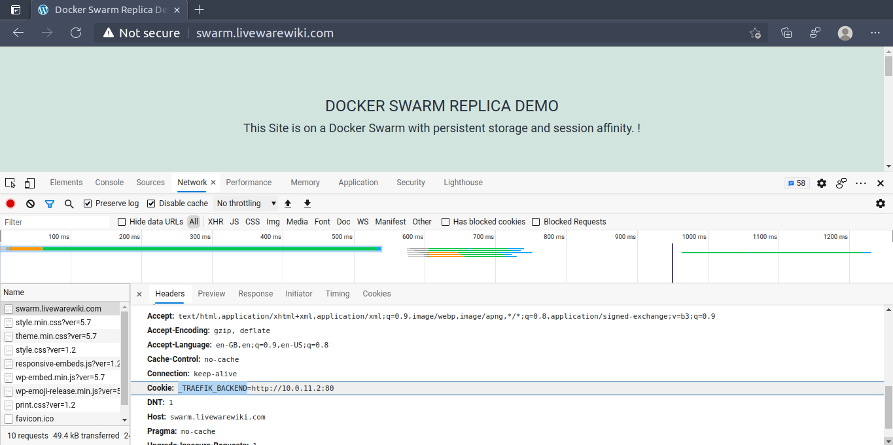

Docker-Swarm

# Docker-Swarm


Docker Swarm is nothing but multiple Docker hosts which run in swarm mode and act as managersand workers. 

- A given Docker host can be a manager, a worker, or both. 

- When we create a service, we define its optimal state (number of replicas, network and storage resources available to it, ports the service exposes to the outside world, and more). Docker works to maintain that desired state.

- Advantages of swarm services:
	- Changes can be deplyed without restarting the whole stack
	- Docker will stop the service tasks with the out of date configuration, and create new ones matching the desired configuration.


## Nodes

- An instance of the Docker engine participating in the swarm. 
- To deploy your application to a swarm, you submit a service definition to a manager node
- The manager node dispatches units of work called tasks to worker nodes.
- Manager nodes also perform the orchestration and cluster management functions required to maintain the desired state of the swarm. 
- Manager nodes elect a single leader to conduct orchestration tasks.

#### Worker Nodes:
- Worker nodes receive and execute tasks dispatched from manager nodes. 
- 
- By default manager nodes also run services as worker nodes, but you can configure them to run manager tasks exclusively and be manager-only nodes.

## Services and tasks

-  `global` services, the swarm runs one task for the service on `every available node in the cluster.`

-  `replicated` services model, the manager distributes a specific number of `replica` tasks among the nodes based upon the `scale`
-  A `task` carries a Docker container and the commands to run inside the container. 

## Load balancing

- Swarm manager uses ingress load balancing by default.
- External components, such as cloud load balancers, `can access the service on the PublishedPort of any node in the cluster whether or not the node is currently running the task for the service.`
- Swarm mode has an internal DNS component that automatically assigns each service in the swarm a DNS entry


## Getting Started.

Following activities are involved in deployemnt of a docker swarm.

1. Initializing a cluster of Docker Engines in swarm mode
2. Adding nodes to the swarm
3. Deploying application services to the swarm
4. Managing the swarm once you have everything running

#### Ports Required :

| Port  | TCP/UDP  | Usage                             |
| ------|--------- | --------------------------------- |
| 2377  | TCP      | cluster management communications |
| 7946  | TCP/UDP  | for communication among nodes     |
| 4789  | UDP      | for overlay network traffic       |

</br>

#### Creation of Swarm

```
$ docker swarm init --advertise-addr <MANAGER-IP>
```
```
$ docker info       #view the current state of the swarm
```
```
$ docker node ls    #view information about nodes
```

</br>

#### Add nodes to the swarm as `Workers`

```
$ docker swarm join --token <accesstoken> ManagerIP:2377

```
#### Add nodes to the swarm as `Manager`

```
$ docker swarm join-token manager

# then execute the token generated in add. manager nods
```

### Deploy a service

Example: 

```
$ docker service create --replicas 1 --name helloworld alpine ping docker.com
```

- The `docker service create` command creates the service.
- The `--name` flag names the service helloworld.
- The `--replicas` flag specifies the desired state of 1 running instance.
- The arguments `alpine ping docker.com` define the service as an Alpine Linux container that executes the command `ping docker.com`

```
# Run docker service ls to see the list of running services:

$ docker service ls
```

### Inspect Services

```
$ docker service inspect <SERVICE-ID>
```

```
docker service ps <SERVICE-ID> 

#To see which nodes are running the services(s)
```

```
docker ps 
# Run on the node where the task is running to see details about the container 
```

### Scale the service(s)

```
$ docker service scale <SERVICE-ID>=<NUMBER-OF-TASKS>
```

For example:

```
$ docker service scale helloworld=5

```


### Delete the service

```
$ docker service rm <SERVICE-Name>
```

### Update a service

```
$ docker service update --image redis:3.0.7 redis
```

The scheduler applies rolling updates as follows by default:

- Stop the first task.
- Schedule update for the stopped task.
- Start the container for the updated task.

If the update to a task returns RUNNING, wait for the specified delay period then start the next task.
If, at any time during the update, a task returns FAILED, pause the update.

```
# To restart a paused update run docker service update <SERVICE-ID>. For example:

$ docker service update redis
```


```
# To avoid repeating certain update failures, 
#you may need to reconfigure the service by passing flags to 
`docker service update`
```

### Drain a node


- `DRAIN` availability prevents a node from receiving new tasks from the swarm manager

```
$ docker node update --availability drain <NODE-ID>

```

### Re-Activate a drained Node/Worker

```
$ docker node update --availability active <NODE-ID>
```

## swarm mode routing mesh

- Docker Engine swarm mode makes it easy to publish ports for services to make them available to resources outside the swarm. All nodes participate in an ingress routing mesh. 

- To use the ingress network in the swarm, you need to have the following ports open between the swarm nodes before you enable swarm mode:

- Port 7946 TCP/UDP for container network discovery.
- Port 4789 UDP for the container ingress network.
- 
### Publish a port for a service

```
$ docker service create \
  --name <SERVICE-NAME> \
  --publish published=<PUBLISHED-PORT>,target=<CONTAINER-PORT> \
  <IMAGE>
```

Example: 

```
$ docker service create \
  --name my-web \
  --publish published=8080,target=80 \
  --replicas 2 \
  nginx
```

- The routing mesh listens on the published port for any IP address assigned to the node. 
- For externally routable IP addresses, the port is available from outside the host. 
- For all other IP addresses the access is only available from within the host.


</br></br>

## Sample Deployment - Wordpress with 3 Replica!


In this demo deployment we are using the following.

-  3 Ubuntu 20.04 EC2 Instances (ie. 3 Manager)
-  MySQL Server on RDS
-  GlusterFS
-  Traefik

> Gluster is a free and open source software scalable network filesystem.
 
> Traefik	:	A HTTP reverse proxy and load balancer made to deploy microservices and supports Docker and Docker Swarm

## Stage 1 : Setup GlusterFS:

```
$ apt-get  install -y glusterfs-server
```

```
# Create a mount target (brick):

$ mkdir -p /glusterfs/bricks/livewarewiki.com
```

```
# add in FSTAB
/dev/xvdf /glusterfs/bricks/livewarewiki.com xfs    defaults        0 0
```

```
# Create a shared folder "wordpress"
$ mkdir /glusterfs/bricks/livewarewiki.com/wordpress
```


```
# Add hosts entries (All 3 Servers)
	172.31.42.145 node1
	172.31.39.147 node2
	172.31.38.147 node3
```


### Establish Gluster cluster nodes trust relationship

From Node1: 
```
$ gluster peer probe node2
$ gluster peer probe node3
```

##  Create a shared volume

```
$ gluster volume create livewarewiki_com-wordpress replica 3 node1:/glusterfs/bricks/livewarewiki.com/wordpress node2:/glusterfs/bricks/livewarewiki.com/wordpress node3:/glusterfs/bricks/livewarewiki.com/wordpress

```

### Start the Volume

```
$ gluster volume start booksfordevops_com-wordpress
```
### List Volumes/Check Status

```
$ gluster volume list
```
```
$ gluster volume status
```

### Create a Local Mount Point to hold Shared WP files(On Each Node)

```
$ mkdir -p /data/livewarewiki_com-wordpress
```

### Update Fstab


> On Each node, add this line at the end of /etc/fstab file:


```
# Node1
node2:/livewarewiki_com-wordpress       /data/livewarewiki_com-wordpress       glusterfs     defaults,_netdev  0  0
node3:/livewarewiki_com-wordpress       /data/livewarewiki_com-wordpress       glusterfs     defaults,_netdev  0  0
```

```
# Node2
node1:/livewarewiki_com-wordpress       /data/livewarewiki_com-wordpress       glusterfs     defaults,_netdev  0  0
node3:/livewarewiki_com-wordpress       /data/livewarewiki_com-wordpress       glusterfs     defaults,_netdev  0  0

```

```
# Node3
node1:/livewarewiki_com-wordpress       /data/livewarewiki_com-wordpress       glusterfs     defaults,_netdev  0  0
node2:/livewarewiki_com-wordpress       /data/livewarewiki_com-wordpress       glusterfs     defaults,_netdev  0  0
```

### Deploy the stack

```
$ docker stack deploy --compose-file=stack.yml WP_Stack_wordpress
```



stack.yml
* * *
```
version: '3'

networks:
  traefik-net:
  livewarewiki_com-network:

services:
# LB
  traefik:
    image: traefik:v1.1.0-rc1
    command: |-
      --docker
      --docker.swarmmode
      --docker.domain="swarm.livewarewiki.com"
      --docker.watch
      --web
    ports:
      - 80:80
    networks:
      - traefik-net
    volumes:
      - /var/run/docker.sock:/var/run/docker.sock
    deploy:
      placement:
        constraints:
          - node.role == manager
# Wordpress Area
  wordpress:
    image: wordpress:php7.4-apache
    ports:
      - 8001:80
    networks:
      - livewarewiki_com-network
      - traefik-net
    volumes:
      - /data/livewarewiki_com-wordpress:/var/www/html
    environment:
      WORDPRESS_DB_HOST: database-1.cfjhh4ywvkvc.ap-south-1.rds.amazonaws.com:3306
      WORDPRESS_DB_USER: admin
      WORDPRESS_DB_PASSWORD: zHAHmtXbYhUNiZoAdUjE
      WORDPRESS_DB_NAME: wordpress
      WORDPRESS_TABLE_PREFIX: wp_
    deploy:
      mode: global #replicas becomes 3 as we have 3 nodes in the swarm
      labels: 
        APP: WORDPRESS
        traefik.port: 80
        traefik.frontend.rule: "Host:swarm.livewarewiki.com,www.swarm.livewarewiki.com"
        traefik.backend.loadbalancer.sticky: "true" #For sticky sessions
      restart_policy:
        condition: on-failure


```
* * *


### Check Swarm Deplyment status

```
docker service ls

```



### Testing site.

```
$ curl -I http://swarm.livewarewiki.com/    
```
```
HTTP/1.1 200 OK
Content-Type: text/html; charset=UTF-8
Date: Fri, 26 Mar 2021 12:09:31 GMT
Link: <http://swarm.livewarewiki.com/wp-json/>; rel="https://api.w.org/"
Server: Apache/2.4.38 (Debian)
Set-Cookie: _TRAEFIK_BACKEND=http://10.0.11.2:80
X-Powered-By: PHP/7.4.16
```



* * *
* * *
* * *