Docker

## Introduction to Docker
* * *
* * *
<br>
Is an open-source containerization platform that allows you to containerize your applications, share them using public or private registries and also to orchestrate them.

*Docker uses a client-server architecture. The Docker client talks to the Docker daemon, which does the heavy lifting of building, running, and distributing your Docker containers.*

- Extended LXC based containerization
- Easy do deploy Containers
- Suitable for micro-services (one process, one container)
- Editions
    - Community
    - Enterprise

<br>

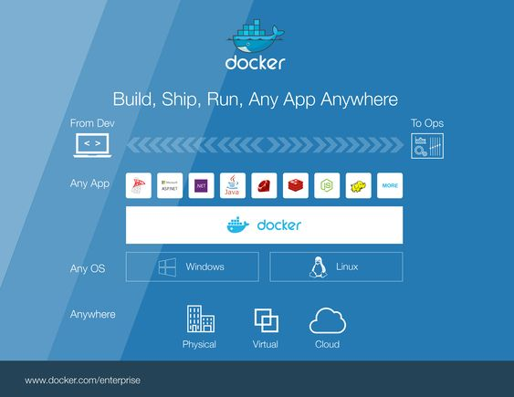


### Alternatives to Docker

- Podman developed by Red Hat.
- Kaniko by Google
- rkt by CoreOS

<br></br>
* * *
* * *
## Docker Fundamental Concepts
* * *
* * *
<br></br>

Docker Architecture and three very fundamental concepts of containerization in general, which are as follows:

- `Registry`
- `Image`
- `Container`

    

#### Container :

A container does the job of virtualization in a smarter way. Instead of having a complete guest operating system inside a container.

it just utilizes the host operating system via the container runtime while maintaining isolation just like a traditional virtual machine.

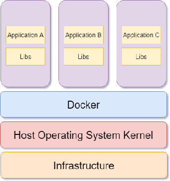

#### Images

Images are multi-layered self-contained files that act as the `template for creating containers.`

`Containers are just images in running state.` When you obtain an image from the internet and run a container using that, you essentially create another temporary writable layer on top of the previous read-only ones.

#### Registry

An image registry is a centralized place where you can upload your images and can also download images created by others.

- **Docker Hub** is the default public registry for Docker.
- Quay by Red Hat.

<br></br>
* * *
* * *
## Docker Architecture
* * *
* * *
<br></br>

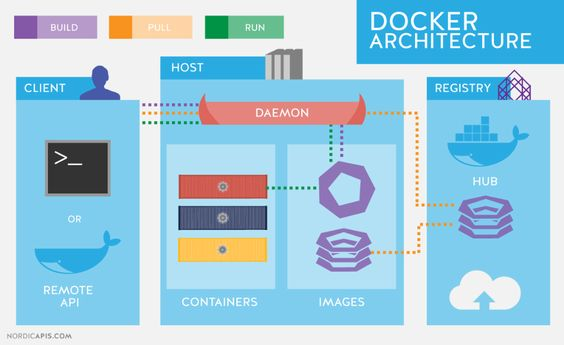

The engine consists of 3 major components:

**Docker Daemon:** The daemon (dockerd) is a process that keeps running in the background and waits for commands from the client. The daemon is capable of managing various Docker objects.

**Docker Client:** The client (docker) is a command-line interface program mostly responsible for transporting commands issued by users.

**REST API:** The REST API acts as a bridge between the daemon and the client. Any command issued using the client passes through the API to finally reach the daemon.

- `Docker uses a client-server architecture.` The Docker client talks to the Docker daemon, which does the heavy lifting of building, running, and distributing your Docker containers.
    
- User will usually execute commands using the client component. The client then use the REST API to reach out to the long running daemon and get your work done.
    

**Diagram :**

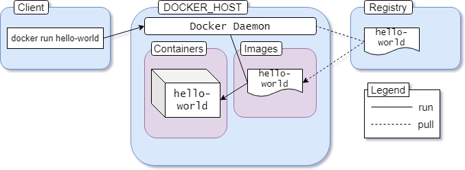

1.  Execute `docker run hello-world` command where hello-world is the name of an image.
2.  Docker client reaches out to the daemon, tells it to get the hello-world image and run a container from that.
3.  Docker daemon looks for the image within your local repository
4.  If not found in local repo, the daemon then reaches out to the `default public registry` which is **Docker Hub** and `pulls` in the latest copy of the hello-world image.
5.  Docker daemon then `creates a new container` from the freshly pulled image.
6.  Finally Docker daemon `runs the container` created using the hello-world image outputting the wall of text on your terminal.

<br></br>
* * *
* * *
## Container Manipulation
* * *
* * *
<br></br>

- [Official reference for the Docker command-line](https://docs.docker.com/engine/reference/commandline/container/)

### CLI

docker `object-type` `command` `options`

In this syntax:

- **object-type** = container, image, network, volume object.
- **command** = task to be carried out by the daemon i.e. **run** command.
- **options** = can be any valid parameter that can override the default behavior of the command i.e. the `--publish` option for port mapping.

#### Running Containers

> *docker run `image_name`*

#### Publishing Ports (Port Mapping)

> *--publish `host port`:`container port`*

#### Detached Mode (--detach or -d)

> *docker container run `--detach` `imagename`*

#### Listing Containers

> *docker container `ls`*

> docker container `ls --all`

#### Stopping/Killing a Running Container

> docker container stop `Container_Name/ID`
> docker container kill `Container_Name/ID`

> docker container start `Container_Name/ID`
> docker container restart `Container_Name/ID`

#### Creating Containers Without Running

`container run` means
- `container create` command creates a container from a given image.
- `container start` command starts a container that has been already created.

so, we can use `docker container create` to **create a container but not start it.**


#### Removing stopped containers

> docker container rm `Container_Name/ID`

To remove all stopped/unused containers 
> docker container prune
> docker container prune -a
	
	
#### Containers - Interactive Mode (-it)

> docker container run `-it` ubuntu

- *-i or --interactive* : connects to bash/sh prompt.
- *-t or --tty* : formats like a normal shell otherwise shows an emptry promt

Similary, To execute a command inside a contiainer

> docker container run `image` `command`

		Ex: docker container run ubuntu uptime

#### Exec (Running Containters)

Execute a command inside running container

> docker container `exec` `nginx` `ls` 
> *or*
>  docker `exec` `nginx` `ls`

or with `-it` for formated output


#### Attach/Detach Mode

 Start container with Detach mode (-d)

To attach, 
- docker container `attach` `dockername/ID`

#### Inspect Containers

> docker `inspect` `ContainerName/ID`

#### Container Logs

> docker `logs` `containername/ID`

#### Environment Variables

> docker run `-e`

<br></br>
* * *
* * *
## Docker Images
* * *
* * *
<br></br>

We can build an IMAGE as per our requirment using te file `Dockerfile`

	
	Step 1 : docker image build .

	Step 2 : docker commit CONTAINTER_ID hub_username/repo:tag

	Step 3(optional) : docker tag IMAGE_ID hub_username/reponame:tag

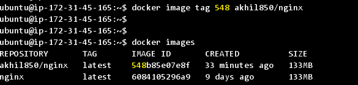
	
	Step 4 : docker push username/repo:tag
	


#### Listing:
> docker image ls
> docker images


#### Removing : 
> docker `image` `rm` `image_ID`

#### Removing Unused images
> docker `image` `prune`

#### Tagging: 
> docker image build --tag custom-nginx:built .

<br></br>
* * *
* * *
## Networking
* * *
* * *
<br></br>
### Types
 - Bridge - default network driver
 - Host - use the host’s networking directly
 - None - disable all networking
 - Overlay
 - MacVLAN

[Read More](https://docs.docker.com/network/)


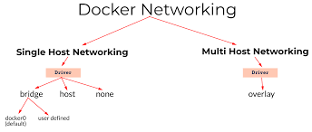

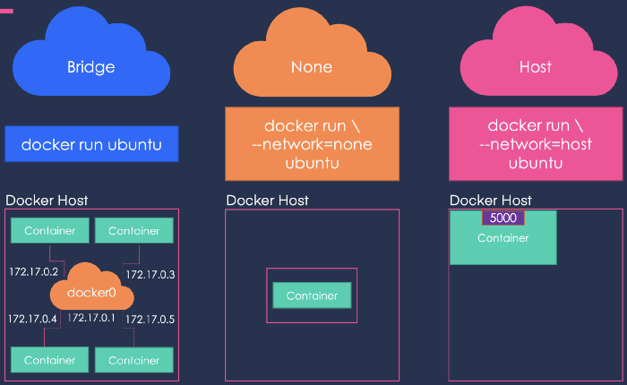

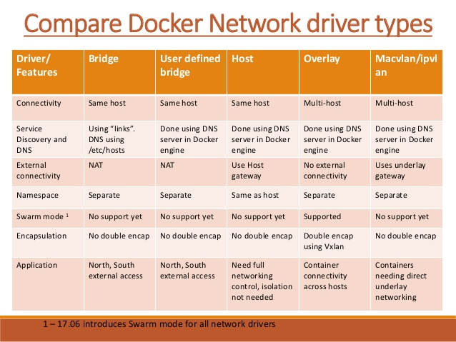

### list 
> docker `network` `ls`


### Create 

> docker `network` `create` `network name`

> docker `network` `create` 
> 	-- driver bridge 
> 	-- subnet 192.168.0.0/16 
> 	-- gateway 192.168.0.1 
	demoNet


### Connect Containers to a Network

> docker network connect `NetworkName/ID` `ContainerName/ID`

Examples:
	
	docker container run --network demoNet --name alpine alpine

### Disconnect Containers from network

> docker network `disconnect` `network identifier` `container identifier`

> docker network `disconnect` `demoNet` `nginx`

<br></br>
* * *
* * *
## Embedded DNS
* * *
* * *
<br></br>
- All containers in the docker host can resolve each other with the name of the container. 

- Docker has a built-in DNS server that helps the containers to resolve each other using the container name. 

- Built-in DNS server always runs at address 127.0.0.11.

.
	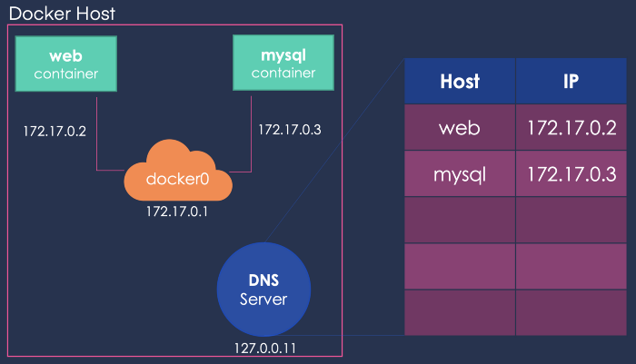
	
	
* * *
* * *
## Docker Storage
* * *
* * *
Docker supports several different storage drivers, using a pluggable architecture. The storage driver controls how images and containers are stored and managed on your Docker host.

### File Sytem :

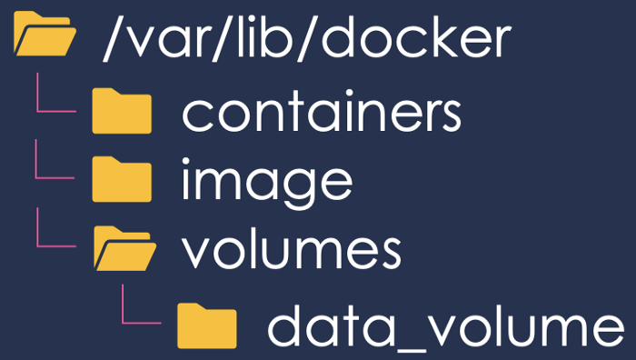

### Layers :

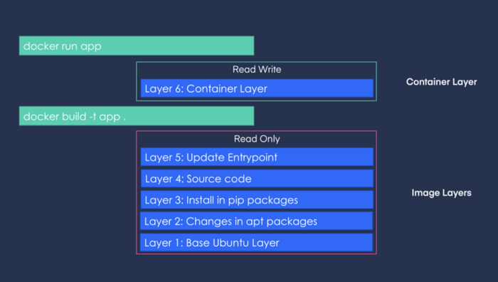

### Copy on write

- To create a contianer, overlay driver combines the directory represeting image's top layer (`lowerdir`) and a new direcotry for contianer (`upperdir`)

	
```	
 /var/lib/docker/overlay/...
				- lowerid
				- merged   (# upper + lower)
				- upperdir (# Contents of container - R/W layer)
				- work     (# internal to autoFS)
					
```

- To check in 

 			Docker host : mount | grep overlay
	
- Overlay2 driver has slight difference.
		
```
	diff  link  lower  merged  work
```
		 
		 

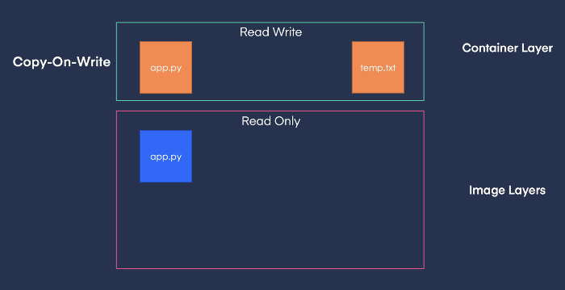

* * *
* * *
## Docker Volumes
* * *
* * *

### Types of Mount

- Bind
- Volume 

### Types of Volumes

- Host volumes

		docker run -v /path/on/host:/path/in/container
		
- Named volumes

			docker volume create VOLUMENAME
			docker run -v VOLUMENAME:/path/in/container ... 

### Create / Delete

> docker volume create [volume_name]

> docker volume rm [volume_name]

> docker volume prune

### List

> docker volume list

### Inspect

> docker volume inspect [volume_name]

Mounting
```
docker run --mount source=[volume_name],destination=[path_in_container] [docker_image]

(or)

docker run -v /localpath:/path_in_container mysql imagename
```

Examples:
```
docker run --mount --type=bind --source=DemoVolume --target=/var/lib/mysql mysql
```

* * *
* * *
## Docker Registry
* * *
* * *

 - Repo of Docker images (Ex. Docker Hub)

### Login

> docker login some-registry.io

### Private Registry (Def Port 5000)

Docker Hub has a private registry Image :
```
docker run -d -p5000:5000 --name MyPrivReg registry:2
```

<br></br>
* * *
* * *
## Docker Compose
* * *
* * *
<br></br>

- Docker Compose uses `docker-compose.yaml` file to read service definitions from.
- Easy to deploy Multiple containers at once
- Every valid docker-compose.yaml file starts by defining the file version

- From docker-compose version 2, 
	* `--links` are not neccessary
	* supports `depends-on`
- Version 3 comes with advanced features 


### Listing Services
> docker-compose `ps`

### Start/Stop 
> docker-compose `up` `-d`

> docker-compose `down` 
### Executing Commands Inside a Running Service
> docker-compose `exec` `service_name` `command`

### Accessing Logs 
> docker-compose `logs` `service_name`


* * *
* * *
</br>


				To be updated. ..
 


