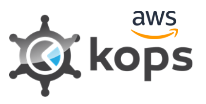
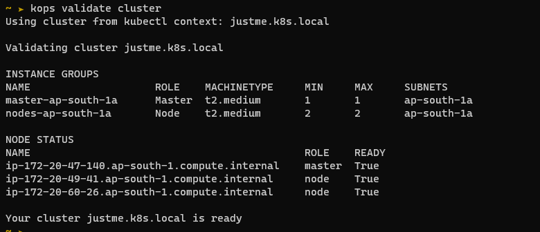
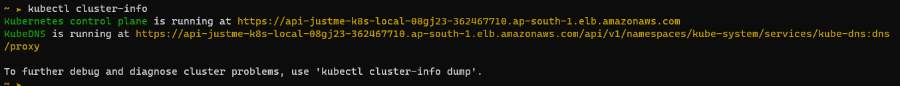
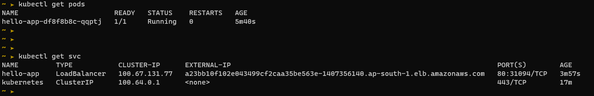
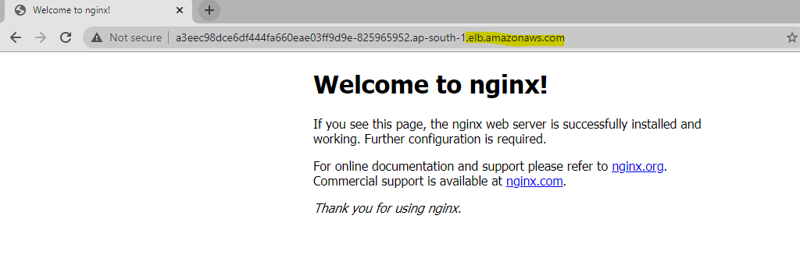

k8s - kOps




> **kOps is Kubernetes Operations.**

kOps is the easiest way to get a production grade Kubernetes cluster up and running. We like to think of it as kubectl for clusters.

kOps helps you create, destroy, upgrade and maintain production-grade, highly available, Kubernetes clusters from the command line. AWS (Amazon Web Services) is currently officially supported, with GCE and OpenStack in beta support

kOps CLI : https://kops.sigs.k8s.io/cli/kops/

<br>

### Running a demo deplyment
* * *

>Step 1 : Setup AWS CLI

> Step 2 : Create an S3 bucket to save the state file.
aws s3 mb s3://k8s-kops-akhbucket1 --region ap-south-1

>Step 3 : Save KOPS_STATE_STORE as env variable for easy cli operations
```
export KOPS_STATE_STORE="s3://k8s-kops-akhbucket1"
-- optional --
export MASTER_SIZE="t2.micro"
export NODE_SIZE="t2.micro"
export ZONES="ap-south-1a"
```

> Step 4 : create a cluster.
```
kops create cluster \
--name=justme.k8s.local \
--state=s3://k8s-kops-akhbucket1 \
--master-size t2.medium \
--master-volume-size 10 \
--master-count 1 \
--master-zones ap-south-1a \
--node-size t2.medium \
--node-volume-size 10 \
--node-count 2 \
--zones ap-south-1a \
--yes
```




<br>

### Deploying Nginx with LoadBalancing
***

>     kubectl create deploy demo-nginx --image=nginx -–replicas=2 --port=80

>     kubectl expose deployment demo-nginx --type=LoadBalancer

**Check Service :** 




**Access ELB as :** 



* * *
* * *